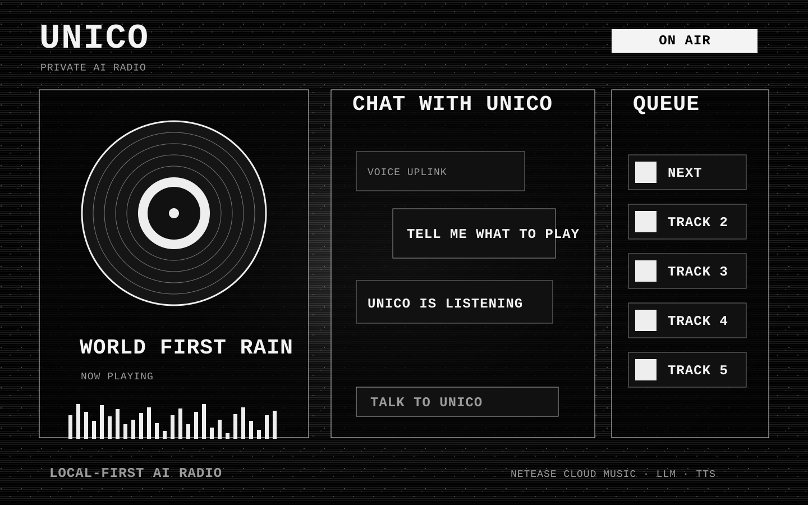
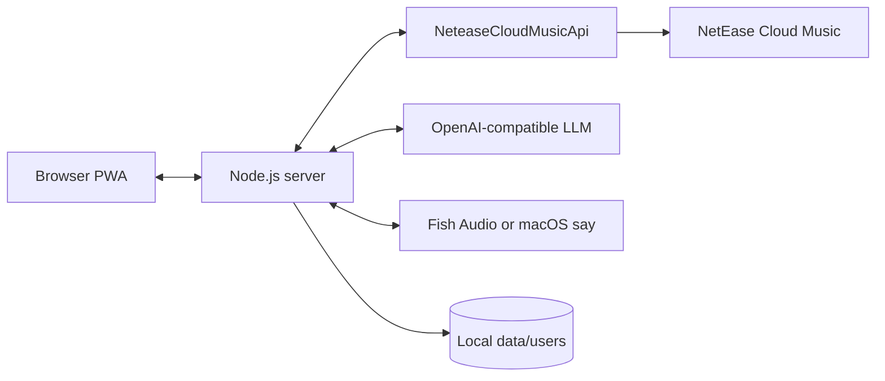

# Unico

> A local-first AI radio host that learns your NetEase Cloud Music taste, curates the next track, and talks over the music like a tiny private DJ.



[](https://nodejs.org/)
[](LICENSE)
[](#privacy)

Unico is a personal AI radio web app. It imports your music profile, builds a listener portrait, keeps a small queue of tracks, and generates short spoken commentary while the music plays. It is designed to run on your own machine: cookies, playlists, listening notes, generated voice files, and feedback logs stay local unless you choose to deploy it somewhere else.

## Highlights

- **Taste onboarding**: QR login, SMS login, Cookie fallback, or public NetEase profile import.
- **AI listener portrait**: turns playlists, weekly charts, and all-time charts into an editable `taste.md`.
- **Private radio host**: introduces songs, reacts to chat, and gives gentle transitions.
- **Music-aware chat**: talk to Unico while a track is playing; music ducks under the voice.
- **Discovery queue**: keeps upcoming tracks ready and avoids recently skipped or disliked songs.
- **Multi-device control**: several browsers can connect, but only the active client plays audio.
- **Local-first data model**: each visitor gets an isolated tenant under `data/users/<uid>`.
- **PWA interface**: installable single-page player with queue, mixer, profile, and setup views.

## How It Works



## Quick Start

### Requirements

- Node.js 20 or newer
- A NetEase Cloud Music account, or a public NetEase profile URL
- One Volcengine Ark API key for Seed 2.1 Pro (OpenAI-compatible)
- Optional: Fish Audio API key for higher-quality TTS

### Install

```bash
git clone https://github.com/YOUR_USERNAME/unico.git
cd unico
npm install
cp .env.example .env
```

Edit `.env`:

```bash
PORT=8080
SEED_MODEL=doubao-seed-2-1-pro-260915
SEED_API_KEY=your_volcengine_ark_key_here
SEED_BASE_URL=https://ark.cn-beijing.volces.com/api/v3

# Optional: voice generation. Without this, Unico falls back to macOS say.
FISH_API_KEY=
FISH_VOICE_ID=
```

Start the app:

```bash
npm run dev
```

Open [http://localhost:8080](http://localhost:8080).

## First Run

Unico opens a setup wizard for new users:

1. Log in with NetEase QR scan.
2. If QR is blocked, use SMS, Cookie, or "public profile import".
3. Unico imports playlists and listening records when available.
4. The LLM drafts a listener portrait.
5. Review and save the portrait, then start the radio.

The public profile path does not require login. It can only read public playlists, but it is enough to start Unico when NetEase blocks QR login.

## Environment Variables

| Variable | Required | Description |
| --- | --- | --- |
| `PORT` | No | HTTP/WebSocket port. Defaults to `8080`. |
| `SEED_MODEL` | No | Chat model name. Defaults to `doubao-seed-2-1-pro-260915`. |
| `SEED_API_KEY` | Yes* | Volcengine Ark API key for Seed chat completions. |
| `SEED_BASE_URL` | No | Defaults to `https://ark.cn-beijing.volces.com/api/v3`. |
| `VOLCENGINE_API_KEY` | No | `SEED_API_KEY` 的兼容变量名。 |
| `VOLCENGINE_BASE_URL` | No | `SEED_BASE_URL` 的兼容变量名。 |
| `UNICO_MODEL` | No | 通用兼容变量，可覆盖模型名。 |
| `OPENAI_API_KEY` | Yes* | Alternative OpenAI-compatible API key. |
| `OPENAI_BASE_URL` | No | Alternative OpenAI-compatible base URL. |
| `FISH_API_KEY` | No | Fish Audio API key for voice synthesis. |
| `FISH_VOICE_ID` | No | Fish Audio voice id. |
| `UNICO_TTS_PROXY` | No | Proxy URL used only for Fish Audio requests. |
| `TTS_PROVIDER` | No | Set to `say` to force macOS local TTS. |
| `NCM_RETRIES` | No | Retry count for NetEase API calls. |

`*` One LLM key is required unless you adapt `server/llm-client.js` to another provider.

## Project Structure

```text
unico/
├── pwa/                  # PWA shell, styles, player logic, service worker
├── server/               # HTTP server, WebSocket runtime, setup API, LLM/TTS/NCM adapters
│   ├── prompts/          # Radio host prompt fragments
│   └── adapters/         # Music provider adapters
├── scripts/              # CLI utilities for import/drafting
├── tests/                # Node test files
├── media/                # Sample media
├── docs/assets/          # README images
└── data/                 # Runtime data, ignored by Git
```

## Privacy

Unico is built as a local-first app.

- `.env`, `data/`, `cache/`, and NetEase cookies are ignored by Git.
- NetEase cookies are stored under `data/users/<uid>/ncm-cookie.txt`.
- Generated playlist dumps and listener portraits are stored under `data/users/<uid>/`.
- TTS audio cache is stored under `cache/tts/`.

Do not commit `.env`, `data/`, `cache/`, or copied cookies. If you deploy Unico publicly, protect the instance as you would protect any app that can hold user login cookies.

## Development

Run the server:

```bash
npm run dev
```

Run tests:

```bash
node --test tests/*.test.js
```

Syntax check key files:

```bash
node --check server/setup-api.js
node --check pwa/src/player.js
```

## Troubleshooting

| Symptom | What to try |
| --- | --- |
| NetEase QR says the device environment is abnormal | Use SMS login, Cookie login, or public profile import. QR status is shown below the setup QR. |
| QR status stays at `801` | The app is waiting for a scan. Regenerate the QR if it expires. |
| QR status reaches `802` but not `803` | The phone scanned the code but did not complete confirmation. |
| Fish Audio returns `402` | Add API credits in Fish Audio Billing, or set `TTS_PROVIDER=say`. |
| NetEase API returns intermittent `502` | Unico retries automatically; wait and retry import. |
| No voice on non-macOS systems without Fish | Configure Fish Audio, or add another TTS provider in `server/tts.js`. |

## Roadmap

- Better QR-login diagnostics and provider abstraction
- More music services beyond NetEase Cloud Music
- Scheduled morning radio sessions
- Long-term listener memory from feedback logs
- Hardware speaker / UPnP output
- Safer hosted deployment mode

## Acknowledgements

- [Binaryify/NeteaseCloudMusicApi](https://github.com/Binaryify/NeteaseCloudMusicApi)
- [Fish Audio](https://fish.audio)
- Volcengine Ark Seed 2.1 Pro / OpenAI-compatible chat completion APIs

## License

MIT. See [LICENSE](LICENSE).
